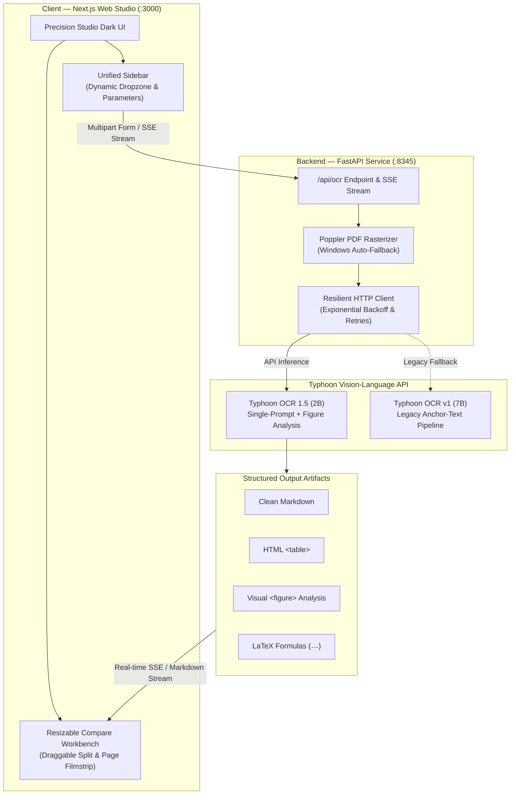

<!-- Improved compatibility of back to top link -->

<a id="readme-top"></a>

<!-- LANGUAGE SWITCHER -->
<p align="center">
  <a href="README.md"></a>
  <a href="README.th.md"></a>
</p>

<!-- PROJECT SHIELDS -->

[![Contributors][contributors-shield]][contributors-url]
[![Forks][forks-shield]][forks-url]
[![Stargazers][stars-shield]][stars-url]
[![Issues][issues-shield]][issues-url]
[![Apache 2.0 License][license-shield]][license-url]

<!-- PROJECT LOGO -->
<br />
<div align="center">
  <a href="https://github.com/naravid19/typhoon-ocr">
    
  </a>

  <h3 align="center">Typhoon OCR</h3>

  <p align="center">
    A powerful OCR application for extracting structured markdown from images and PDFs
    <br />
    <a href="https://github.com/naravid19/typhoon-ocr"><strong>Explore the docs »</strong></a>
    <br />
    <br />
    <a href="https://github.com/naravid19/typhoon-ocr">View Demo</a>
    &middot;
    <a href="https://github.com/naravid19/typhoon-ocr/issues/new?labels=bug">Report Bug</a>
    &middot;
    <a href="https://github.com/naravid19/typhoon-ocr/issues/new?labels=enhancement">Request Feature</a>
  </p>
</div>

<!-- TABLE OF CONTENTS -->
<details>
  <summary>Table of Contents</summary>
  <ol>
    <li>
      <a href="#about-the-project">About The Project</a>
      <ul>
        <li><a href="#built-with">Built With</a></li>
        <li><a href="#system-architecture">System Architecture</a></li>
      </ul>
    </li>
    <li>
      <a href="#getting-started">Getting Started</a>
      <ul>
        <li><a href="#prerequisites">Prerequisites</a></li>
        <li><a href="#installation">Installation</a></li>
      </ul>
    </li>
    <li><a href="#usage">Usage</a></li>
    <li><a href="#features">Features</a></li>
    <li><a href="#roadmap">Roadmap</a></li>
    <li><a href="#contributing">Contributing</a></li>
    <li><a href="#license">License</a></li>
    <li><a href="CHANGELOG.md">Changelog</a></li>
    <li><a href="#contact">Contact</a></li>
    <li><a href="#acknowledgments">Acknowledgments</a></li>
  </ol>
</details>

<!-- ABOUT THE PROJECT -->

## About The Project

[![Product Name Screen Shot][product-screenshot]](https://github.com/naravid19/typhoon-ocr/images/screenshot.png)

Typhoon OCR is an advanced vision-language model for extracting structured markdown from images or PDFs. It excels at document layout analysis, table extraction, LaTeX mathematical equation parsing, and visual diagram understanding (`<figure>`).

This fork provides a modern **Next.js web application** alongside the original Gradio demo, featuring:

- 🎛️ **Precision Studio Dark UI**: Enterprise Obsidian theme (`#09090b`), tactile surfaces, 1px subtle borders, disciplined Typhoon Violet accent (`#8b5cf6`), and zero emoji noise in UI chrome ([ADR 0003](docs/adr/0003-unified-studio-workspace-and-design-system.md), [DESIGN.md](DESIGN.md))
- 📑 **Unified Sidebar**: Document ingestion and inference parameter controls consolidated into a single vertical scrollable sidebar—eliminating context-switching tabs
- 🪟 **Resizable Compare Workbench**: Interactive draggable split divider (22%–78%), Fit vs 100% natural resolution zoom controls, and quick page hopping filmstrip pills (`P.1`, `P.2`...)
- 🚀 **Hardened CLI Launcher (`start_app.bat`)**: 4-phase diagnostic startup, port 8345 & 3000 conflict detection, safe ping delay, hoisted dependency cache check, and exit pause
- 🤖 **Typhoon OCR 1.5 Architecture**: Official support for `typhoon-ocr` (2B) unified single-prompt model, alongside legacy `typhoon-ocr-preview` (7B) anchor-text pipeline
- 📐 **LaTeX & Visual Diagram Analysis**: Extracts mathematical formulas and figures with configurable explanation language (`figure_language`: Thai / English)
- 📊 **Rich Markdown & HTML Rendering**: Embedded `<table>`, `<figure>`, and `<page_number>` tags rendered natively with responsive styling
- 📄 **Multi-page PDF support** with interactive page selection and viewport-based lazy loading
- 🔗 **SSRF-Protected URL Import**: Secure document loading from remote URLs with DNS and CIDR filtering ([ADR 0002](docs/adr/0002-ssrf-mitigation-in-proxy.md))
- 📈 **Real-time SSE progress** indicators and elapsed latency timer during OCR processing
- 🤖 **Smart Resume & Retry**: Automatically filter successful files and retry only rate-limited or failed files (e.g., HTTP 429) without losing queue progress
- ⚙️ **Dynamic Model Discovery & Limits**: Dynamically discover models (`/api/models`) and adjust `MAX_FILES` directly via the in-app Settings panel
- 🔄 **In-App Auto-Update**: Safe one-click GitHub update (`git pull`) with sanitized parameter checking

> **This fork focuses on Windows 10/11.** For macOS/Linux setup, please refer to the official Typhoon OCR repository.
>
> 📝 **See [CHANGELOG.md](CHANGELOG.md) for latest updates.**

<p align="right">(<a href="#readme-top">back to top</a>)</p>

### Built With

- [![Next][Next.js]][Next-url]
- [![React][React.js]][React-url]
- [![TailwindCSS][TailwindCSS]][TailwindCSS-url]
- [![FastAPI][FastAPI]][FastAPI-url]
- [![Python][Python]][Python-url]

<p align="right">(<a href="#readme-top">back to top</a>)</p>

### System Architecture

The following diagram illustrates the end-to-end processing pipeline, from document ingestion in the Next.js Studio to async inference with Typhoon OCR:



<p align="right">(<a href="#readme-top">back to top</a>)</p>

<!-- GETTING STARTED -->

## Getting Started

To get a local copy up and running follow these steps.

### Prerequisites

- **Windows 10/11** with Python 3.10+
- **Node.js 18+** with npm
- **Poppler** (for PDF processing)

Install Poppler using PowerShell:

```powershell
iwr -useb https://github.com/oschwartz10612/poppler-windows/releases/download/v25.07.0-0/Release-25.07.0-0.zip -OutFile $env:TEMP\poppler.zip; rm C:\poppler -Recurse -Force -ErrorAction SilentlyContinue; Expand-Archive $env:TEMP\poppler.zip C:\poppler -Force; $bin=(Get-ChildItem C:\poppler -Recurse -Filter pdfinfo.exe | Select-Object -First 1).DirectoryName; if(-not $bin){throw "pdfinfo.exe not found under C:\poppler"}; $u=[Environment]::GetEnvironmentVariable('Path','User'); if([string]::IsNullOrEmpty($u)){$u=''}; if($u -notlike "*$bin*"){[Environment]::SetEnvironmentVariable('Path', ($u.TrimEnd(';')+';'+$bin).Trim(';'), 'User')}; $env:Path+=';'+$bin; pdfinfo -v
```

Verify installation:

```powershell
pdfinfo -v
pdftoppm -v
```

### Installation

1. **Clone the repo**

   ```sh
   git clone https://github.com/naravid19/typhoon-ocr.git
   cd typhoon-ocr
   ```

2. **Configure environment**

   Create a `.env` file in the project root:

   ```ini
   TYPHOON_BASE_URL=https://api.opentyphoon.ai/v1
   TYPHOON_API_KEY=YOUR_API_KEY
   TYPHOON_OCR_MODEL=typhoon-ocr
   # Optional settings
   TYPHOON_MAX_FILES=10
   ```

   > **Supported Models:**
   > - `typhoon-ocr`: Official Typhoon OCR 1.5 (2B) — unified single-prompt architecture (Markdown, LaTeX, tables, figures). **(Default & Recommended)**
   > - `typhoon-ocr-preview`: Legacy Typhoon OCR v1 (7B) — anchor-text prompting (`default` vs `structure`).

3. **Set up Backend (Python)**

   ```sh
   python -m venv venv
   .\venv\Scripts\activate
   pip install -r backend/requirements.txt
   ```

4. **Set up Frontend (Next.js)**

   ```sh
   cd frontend
   npm install
   ```

5. **Run the application**

   ### Option A: One-Click Start (Recommended)

   Simply double-click the **`start_app.bat`** file in the project root.

   > The script automatically detects your virtual environment and opens the browser for you.

   ### Option B: Manual Start

   **Terminal 1 - Backend:**

   ```sh
   python -m uvicorn backend.main:app --reload --port 8345
   ```

   Terminal 2 - Frontend:

   ```sh
   cd frontend
   npm run dev
   ```

6. **Open in browser**

   Navigate to [http://localhost:3000/ocr](http://localhost:3000/ocr)

<p align="right">(<a href="#readme-top">back to top</a>)</p>

<!-- USAGE -->

## Usage

1. **Upload a document** - Drag & drop or click to upload PDF/images
2. **Import from URL** - Paste a URL to load documents directly from the web
3. **Select pages** - For multi-page PDFs, select specific pages or use quick actions (Select All, Odd/Even, Range)
4. **Configure parameters** - Adjust temperature, top_p, and other OCR settings
5. **Run OCR** - Click "Run OCR" and monitor progress
6. **View results** - Switch between Combined and Compare views

<p align="right">(<a href="#readme-top">back to top</a>)</p>

<!-- FEATURES -->

## Features

- 🎛️ **Precision Studio Dark UI**: Enterprise Obsidian theme (`#09090b`), tactile 1px subtle borders, zero emoji UI chrome, and monospace tabular numbers for telemetry
- 📑 **Unified Sidebar**: Single scrollable sidebar consolidating document queue, dynamic compact dropzone, and inference parameters
- 🪟 **Resizable Compare Workbench**: Interactive draggable split divider (22%–78%), Fit vs 100% natural resolution zoom controls, and quick page hopping filmstrip pills (`P.1`, `P.2`...)
- 🚀 **Hardened CLI Launcher (`start_app.bat`)**: 4-phase diagnostic startup, port 8345 & 3000 conflict checks, safe ping delay, hoisted dependency cache check, and exit pause
- ✅ Upload PDF or images (PNG, JPG, WebP)
- 🚀 **Typhoon OCR 1.5 Integration**: Unified single-prompt extraction for Markdown, LaTeX equations, and HTML tables
- 🖼️ **Figure Visual Analysis**: Configurable figure description language (`th` / `en`) for diagram and illustration breakdowns
- 🎯 **Dynamic Model Discovery**: Live model list synced between backend `/api/models` and frontend UI (`typhoon-ocr` 1.5 2B, `typhoon-ocr-preview` v1 7B, and custom models)
- 🚀 **Multi-File Batch OCR**: Upload & queue up to 10 documents simultaneously
- ⚡ **Sliding Window Concurrent Engine**: Process multiple files in parallel with low memory footprint
- ✅ Multi-page PDF selection with visual grid preview & **viewport-based lazy loading** (prevents memory lag)
- 🛡️ **SSRF-Hardened URL Import**: Safe web document import with multi-layer IP/DNS filtering ([ADR 0002](docs/adr/0002-ssrf-mitigation-in-proxy.md))
- 🔄 **Automatic API Retries**: Resilient exponential backoff handling of rate limits (HTTP 429) and transient server errors
- 🪟 **Windows Poppler Auto-Fallback**: Seamless PDF rendering on Windows without manual PATH configuration ([ADR 0001](docs/adr/0001-poppler-windows-monkey-patch.md))
- ✅ Shift-click for range selection & quick actions (Select All, Odd/Even pages, Custom range)
- ⚡ **Lightning Fast Asynchronous Backend** processing pages concurrently via `asyncio`
- ⚡ **Progressive Page Rendering**: Render multi-page markdown outputs smoothly without freezing the UI
- 📊 **Native Table & Figure Rendering**: Embedded HTML `<table>` and `<figure>` tags rendered cleanly via `rehype-raw`
- ✅ Real-time progress indicator per file with live status badges and elapsed latency timer
- ✅ Tabbed results navigation with "+X more" overflow dropdown
- ✅ Compare mode: Original image vs. extracted text with resizable divider
- 📦 **Flexible Export Options**: Copy text/markdown (per-file or merged) & Download `.md` or `.zip` archives (with filename deduplication)
- ✅ Code generator for API integration (Python, cURL, JavaScript)

<p align="right">(<a href="#readme-top">back to top</a>)</p>

<!-- ROADMAP -->

## Roadmap

- [x] Modern Next.js frontend
- [x] Multi-page PDF selection with preview
- [x] URL import with SSRF-protected proxy
- [x] Progress indicators with Server-Sent Events (SSE)
- [x] Compare view mode
- [x] **Asynchronous/Concurrent OCR processing**
- [x] **Batch multi-file processing (up to 10 files)**
- [x] **Export to Markdown (`.md`) and ZIP archives (`.zip`) (per-file & merged)**
- [x] **Typhoon OCR 1.5 Architecture Alignment (Single-prompt, LaTeX, Figure analysis, HTML tables)**
- [x] **Dynamic model discovery and contextual configuration**
- [x] **API retry resilience & Windows Poppler auto-fallback**
- [x] **Precision Studio Dark UI & Resizable Compare Workbench ([ADR 0003](docs/adr/0003-unified-studio-workspace-and-design-system.md))**
- [x] **Unified Sidebar Workspace with dynamic compact dropzone**
- [x] **Hardened Windows CLI launcher (`start_app.bat`) with port conflict detection**
- [ ] Support for more document types

See the [open issues](https://github.com/naravid19/typhoon-ocr/issues) for a full list of proposed features (and known issues).

<p align="right">(<a href="#readme-top">back to top</a>)</p>

<!-- CONTRIBUTING -->

## Contributing

Contributions are what make the open source community such an amazing place to learn, inspire, and create. Any contributions you make are **greatly appreciated**.

1. Fork the Project
2. Create your Feature Branch (`git checkout -b feature/AmazingFeature`)
3. Commit your Changes (`git commit -m 'Add some AmazingFeature'`)
4. Push to the Branch (`git push origin feature/AmazingFeature`)
5. Open a Pull Request

<p align="right">(<a href="#readme-top">back to top</a>)</p>

<!-- LICENSE -->

## License

Distributed under the Apache 2.0 License. See `LICENSE` for more information.

<p align="right">(<a href="#readme-top">back to top</a>)</p>

<!-- CONTACT -->

## Contact

Project Link: [https://github.com/naravid19/typhoon-ocr](https://github.com/naravid19/typhoon-ocr)

<p align="right">(<a href="#readme-top">back to top</a>)</p>

<!-- ACKNOWLEDGMENTS -->

## Acknowledgments

- [SCB10X Typhoon OCR](https://github.com/scb10x/typhoon-ocr) - Original project
- [OpenAI](https://openai.com) - API compatibility
- [Best-README-Template](https://github.com/othneildrew/Best-README-Template) - README template
- [Shields.io](https://shields.io) - Badges

<p align="right">(<a href="#readme-top">back to top</a>)</p>

<!-- MARKDOWN LINKS & IMAGES -->

[contributors-shield]: https://img.shields.io/github/contributors/naravid19/typhoon-ocr.svg?style=for-the-badge
[contributors-url]: https://github.com/naravid19/typhoon-ocr/graphs/contributors
[forks-shield]: https://img.shields.io/github/forks/naravid19/typhoon-ocr.svg?style=for-the-badge
[forks-url]: https://github.com/naravid19/typhoon-ocr/network/members
[stars-shield]: https://img.shields.io/github/stars/naravid19/typhoon-ocr.svg?style=for-the-badge
[stars-url]: https://github.com/naravid19/typhoon-ocr/stargazers
[issues-shield]: https://img.shields.io/github/issues/naravid19/typhoon-ocr.svg?style=for-the-badge
[issues-url]: https://github.com/naravid19/typhoon-ocr/issues
[license-shield]: https://img.shields.io/github/license/naravid19/typhoon-ocr.svg?style=for-the-badge
[license-url]: https://github.com/naravid19/typhoon-ocr/blob/main/LICENSE
[product-screenshot]: images/screenshot.png
[Next.js]: https://img.shields.io/badge/next.js-000000?style=for-the-badge&logo=nextdotjs&logoColor=white
[Next-url]: https://nextjs.org/
[React.js]: https://img.shields.io/badge/React-20232A?style=for-the-badge&logo=react&logoColor=61DAFB
[React-url]: https://reactjs.org/
[TailwindCSS]: https://img.shields.io/badge/Tailwind_CSS-38B2AC?style=for-the-badge&logo=tailwind-css&logoColor=white
[TailwindCSS-url]: https://tailwindcss.com/
[FastAPI]: https://img.shields.io/badge/FastAPI-009688?style=for-the-badge&logo=fastapi&logoColor=white
[FastAPI-url]: https://fastapi.tiangolo.com/
[Python]: https://img.shields.io/badge/Python-3776AB?style=for-the-badge&logo=python&logoColor=white
[Python-url]: https://python.org/
